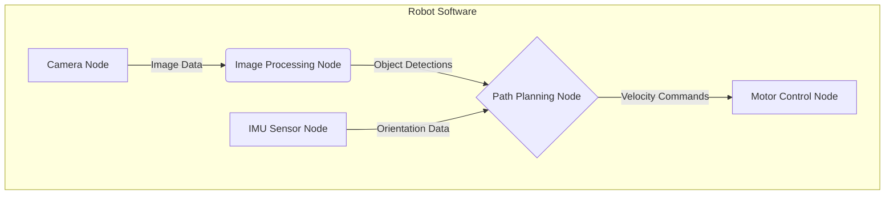

# Introduction to The Robotic Nervous System (ROS 2)

Welcome to the foundational module of our journey into humanoid robotics. Just as a biological organism relies on a nervous system to connect its brain to its muscles and sensors, a robot relies on a communication framework to link its computational "brain" with its physical components. In modern robotics, the de facto standard for this framework is the **Robot Operating System (ROS)**, and we will be focusing on its latest iteration, ROS 2.

## What is ROS 2?

ROS 2 is not a traditional operating system like Windows or Linux. Instead, it's a flexible framework and set of tools for writing robot software. It provides a structured communication layer that allows different parts of a robot's software—from low-level sensor drivers to high-level planning algorithms—to discover each other and exchange information seamlessly.

### Core ROS 2 Concepts

The ROS 2 communication model is based on a graph architecture where processes, called **nodes**, communicate with each other by passing **messages** via named **topics**.

1.  **Nodes**: A node is the smallest unit of computation in ROS 2. Think of it as a single-purpose program. You might have one node for reading a laser scanner, another for controlling wheel motors, and a third for planning a path.
2.  **Topics**: Topics are the buses over which nodes exchange messages. A node can "publish" messages to a topic, and any number of other nodes can "subscribe" to that topic to receive those messages. This publish-subscribe model decouples nodes from each other, making the system highly modular.
3.  **Messages**: Messages are the data structures that nodes send and receive. ROS 2 provides a rich set of standard message types (e.g., for sensor data, robot state) and allows you to define your own custom message types.

## Node Architecture Diagram

The following diagram illustrates how different nodes might communicate in a simple robot.



## Practical Example: A Basic Publisher Node

Let's look at a simple C++ node that publishes a "Hello, World!" message to a topic named `chatter`.

```cpp
#include "rclcpp/rclcpp.hpp"
#include "std_msgs/msg/string.hpp"
#include <chrono>

using namespace std::chrono_literals;

class MinimalPublisher : public rclcpp::Node
{
public:
  MinimalPublisher()
  : Node("minimal_publisher"), count_(0)
  {
    publisher_ = this->create_publisher<std_msgs::msg::String>("chatter", 10);
    timer_ = this->create_wall_timer(
      500ms, std::bind(&MinimalPublisher::timer_callback, this));
  }

private:
  void timer_callback()
  {
    auto message = std_msgs::msg::String();
    message.data = "Hello, world! " + std::to_string(count_++);
    RCLCPP_INFO(this->get_logger(), "Publishing: '%s'", message.data.c_str());
    publisher_->publish(message);
  }
  rclcpp::TimerBase::SharedPtr timer_;
  rclcpp::Publisher<std_msgs::msg::String>::SharedPtr publisher_;
  size_t count_;
};

int main(int argc, char * argv[])
{
  rclcpp::init(argc, argv);
  rclcpp::spin(std::make_shared<MinimalPublisher>());
  rclcpp::shutdown();
  return 0;
}
```

This node initializes a publisher, sets up a timer to fire every 500 milliseconds, and in the timer's callback, it creates and publishes a message.

## Chapter Summary

In this chapter, we introduced the fundamental concepts of ROS 2. We learned that ROS 2 is a communication framework that uses a graph of nodes passing messages over topics. This modular, decoupled architecture is the key to building complex yet flexible robot software systems.

## Assessment

1.  What is the primary role of ROS 2 in a robotic system?
2.  Explain the relationship between a node, a topic, and a message.
3.  In the provided code example, what would happen if two different nodes published to the same `chatter` topic? What if no nodes were subscribing?
