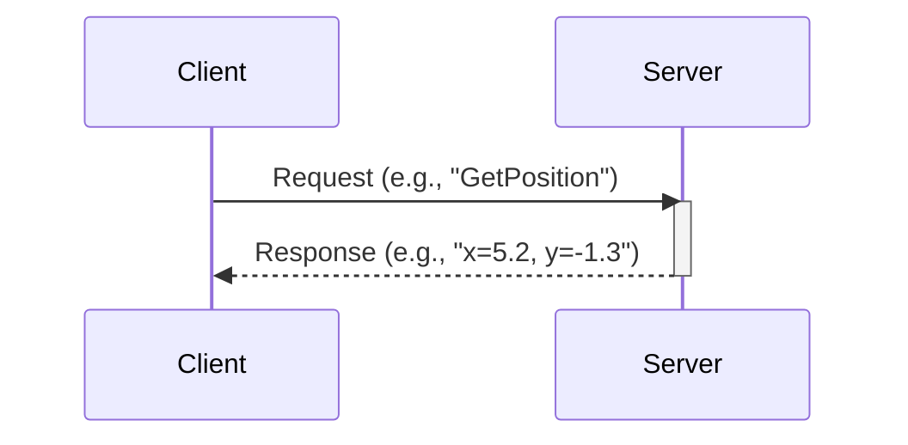

# ROS 2 Services and Actions

While topics are perfect for continuous data streams (like sensor readings), robotics often requires different communication patterns. Sometimes, you need a direct request-response interaction, or you need to command a long-running task and receive feedback. For these scenarios, ROS 2 provides **Services** and **Actions**.

## Services: Synchronous Request-Response

A **Service** is a synchronous, two-way communication pattern. It's like calling a function on another node. One node (the *client*) sends a *request* and waits until another node (the *server*) performs some work and sends back a *response*.

This pattern is ideal for tasks that are quick and must be completed before the client node can continue.

-   **Use Case**: Querying the state of a hardware driver, requesting a camera snapshot, or asking a localization system for the robot's current position.



## Actions: Asynchronous, Long-Running Tasks

An **Action** is used for long-running, asynchronous tasks that provide feedback during their execution. It's the most complex of the ROS 2 communication patterns, but it's essential for non-trivial robot behaviors.

An Action involves three parties:
-   An **Action Client** sends a *goal* to the Action Server.
-   An **Action Server** accepts the goal, performs the work, and sends periodic *feedback* and a final *result*.
-   The **Action Client** can monitor the feedback and can also send a request to cancel the goal at any time.

-   **Use Case**: Navigating to a specific point on a map (which could take minutes), executing a multi-step manipulator arm movement, or performing a 360-degree sensor scan.

### Practical Example: A Fibonacci Action Server

Here is a simple Action Server written in Python that calculates a Fibonacci sequence. The client sends a goal specifying the `order` of the sequence, the server calculates it incrementally while publishing `feedback`, and finally returns the full sequence as the `result`.

```python
import rclpy
from rclpy.action import ActionServer
from rclpy.node import Node

from action_tutorials_interfaces.action import Fibonacci

class FibonacciActionServer(Node):

    def __init__(self):
        super().__init__('fibonacci_action_server')
        self._action_server = ActionServer(
            self,
            Fibonacci,
            'fibonacci',
            self.execute_callback)

    def execute_callback(self, goal_handle):
        self.get_logger().info('Executing goal...')

        feedback_msg = Fibonacci.Feedback()
        feedback_msg.partial_sequence = [0, 1]

        for i in range(1, goal_handle.request.order):
            feedback_msg.partial_sequence.append(
                feedback_msg.partial_sequence[i] + feedback_msg.partial_sequence[i-1])
            self.get_logger().info('Feedback: {0}'.format(feedback_msg.partial_sequence))
            goal_handle.publish_feedback(feedback_msg)
            # Add a small delay to simulate a long-running task
            rclpy.spin_once(self, timeout_sec=0.1)

        goal_handle.succeed()

        result = Fibonacci.Result()
        result.sequence = feedback_msg.partial_sequence
        return result

def main(args=None):
    rclpy.init(args=args)
    fibonacci_action_server = FibonacciActionServer()
    rclpy.spin(fibonacci_action_server)

if __name__ == '__main__':
    main()
```

This example clearly shows the key features of an Action: accepting a goal, publishing feedback during execution, and returning a final result upon success.

## Chapter Summary

In this chapter, we distinguished between the three primary ROS 2 communication patterns:
-   **Topics**: For asynchronous, one-to-many data streaming.
-   **Services**: For synchronous, one-to-one request-response interactions.
-   **Actions**: For asynchronous, one-to-one long-running tasks that require feedback.

Understanding when to use each pattern is crucial for designing robust and efficient robotic systems.
