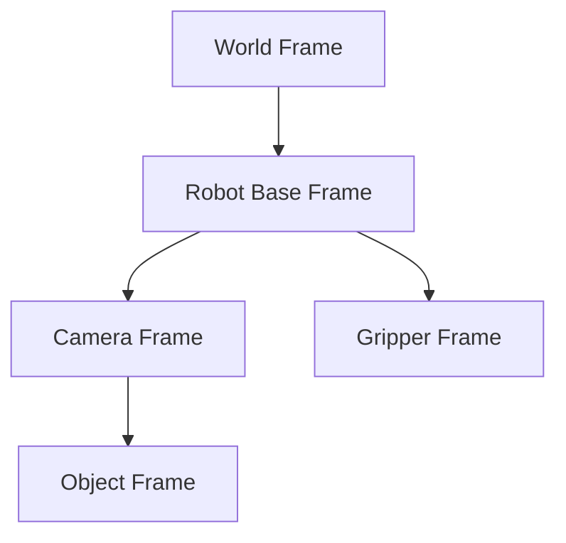

# ROS 2 TF2: Coordinate Frames and Transforms

In robotics, everything moves. Robots move, sensors move, objects in the environment move. To describe where things are in relation to each other, we use **coordinate frames** and **transforms**. The **TF2** (Transform Frame) library in ROS 2 is the standard way to keep track of these coordinate frames and transform data between them.

## The Importance of TF2

Imagine a robot arm trying to pick up an object detected by a camera. The object's position is reported in the camera's frame, the arm's joints are relative to its base frame, and the robot itself is somewhere in a world frame. TF2 allows you to:

-   **Represent the relationship** between multiple coordinate frames over time.
-   **Transform data** (e.g., a point, a vector, a pose) from one coordinate frame to another.
-   **Answer questions** like "Where is the object relative to the robot's gripper?"

## Coordinate Frames and the TF Tree

In TF2, all coordinate frames are organized into a tree structure, called the **TF tree**. Each node in the tree represents a coordinate frame, and the edges represent the transforms between parent and child frames.


In this example:
-   `World Frame` is the fixed reference for the environment.
-   `Robot Base Frame` is where the robot's base is in the world.
-   `Camera Frame` is where the camera is mounted on the robot.
-   `Gripper Frame` is the end-effector of the robot arm.
-   `Object Frame` is the detected object's position relative to the camera.

TF2 calculates the necessary transforms to go from any frame to any other frame in the tree.

## C++ Example: Publishing a TF2 Transform

Let's look at a C++ example of a node that publishes a static transform. This is useful for fixed sensors or components on a robot.

```cpp
#include <memory>
#include <string>

#include "rclcpp/rclcpp.hpp"
#include "tf2_ros/static_transform_broadcaster.h"
#include "geometry_msgs/msg/transform_stamped.hpp"

// Function to create a static transform message
geometry_msgs::msg::TransformStamped make_static_transform(
  const std::string & parent_frame,
  const std::string & child_frame,
  double x, double y, double z,
  double qx, double qy, double qz, double qw)
{
  geometry_msgs::msg::TransformStamped t;
  t.header.stamp = rclcpp::Clock().now();
  t.header.frame_id = parent_frame;
  t.child_frame_id = child_frame;

  t.transform.translation.x = x;
  t.transform.translation.y = y;
  t.transform.translation.z = z;

  t.transform.rotation.x = qx;
  t.transform.rotation.y = qy;
  t.transform.rotation.z = qz;
  t.transform.rotation.w = qw;

  return t;
}

int main(int argc, char * argv[])
{
  rclcpp::init(argc, argv);
  auto node = rclcpp::Node::make_shared("static_tf2_broadcaster");

  // Create a static transform broadcaster
  std::shared_ptr<tf2_ros::StaticTransformBroadcaster> tf_static_broadcaster_ =
    std::make_shared<tf2_ros::StaticTransformBroadcaster>(node);

  // Define a static transform: base_link to camera_link
  // Position: 0.1m x, 0m y, 0.2m z
  // Orientation: no rotation (quaternion 0,0,0,1)
  geometry_msgs::msg::TransformStamped static_transform_stamped =
    make_static_transform("base_link", "camera_link", 0.1, 0.0, 0.2, 0.0, 0.0, 0.0, 1.0);

  // Publish the static transform
  tf_static_broadcaster_->sendTransform(static_transform_stamped);
  RCLCPP_INFO(node->get_logger(), "Published static transform from 'base_link' to 'camera_link'");

  rclcpp::spin(node);
  rclcpp::shutdown();
  return 0;
}
```

This node sets up a `StaticTransformBroadcaster` to publish a transform once. For dynamic transforms (e.g., a moving robot), you would use a `TransformBroadcaster` in a loop.

## C++ Example: Listening to a TF2 Transform

To get information about a transform between two frames, you use a `TransformListener`.

```cpp
#include <memory>
#include <string>
#include <chrono>

#include "rclcpp/rclcpp.hpp"
#include "tf2_ros/transform_listener.h"
#include "tf2_ros/buffer.h"

using namespace std::chrono_literals;

class FrameListener : public rclcpp::Node
{
public:
  FrameListener()
  : Node("frame_listener")
  {
    tf_buffer_ = std::make_unique<tf2_ros::Buffer>(this->get_clock());
    tf_listener_ = std::make_shared<tf2_ros::TransformListener>(*tf_buffer_);

    // Create a timer to periodically check for transforms
    timer_ = this->create_wall_timer(
      500ms, std::bind(&FrameListener::on_timer, this));
  }

private:
  void on_timer()
  {
    geometry_msgs::msg::TransformStamped t;
    try {
      t = tf_buffer_->lookupTransform(
        "base_link", "camera_link", tf2::TimePointZero);
    } catch (const tf2::TransformException & ex) {
      RCLCPP_INFO(
        this->get_logger(), "Could not transform 'camera_link' to 'base_link': %s", ex.what());
      return;
    }

    RCLCPP_INFO(
      this->get_logger(), "Transform from 'base_link' to 'camera_link': x=%f y=%f z=%f",
      t.transform.translation.x, t.transform.translation.y, t.transform.translation.z);
  }

  std::unique_ptr<tf2_ros::Buffer> tf_buffer_;
  std::shared_ptr<tf2_ros::TransformListener> tf_listener_;
  rclcpp::TimerBase::SharedPtr timer_;
};

int main(int argc, char * argv[])
{
  rclcpp::init(argc, argv);
  rclcpp::spin(std::make_shared<FrameListener>());
  rclcpp::shutdown();
  return 0;
}
```

This listener node continuously tries to look up the transform between `base_link` and `camera_link` and prints it.

## Chapter Summary

TF2 is an indispensable tool in ROS 2 for managing the complex spatial relationships between various components of a robot and its environment. By providing a standardized way to broadcast and listen for transforms, TF2 simplifies the development of robot navigation, manipulation, and perception systems.

## Assessment

1.  Why is TF2 essential for a robotic system with multiple sensors and moving parts?
2.  Describe the purpose of the TF tree.
3.  When would you use a `StaticTransformBroadcaster` versus a regular `TransformBroadcaster`?
4.  In the `FrameListener` example, what would happen if the `lookupTransform` call failed? How is this handled?
