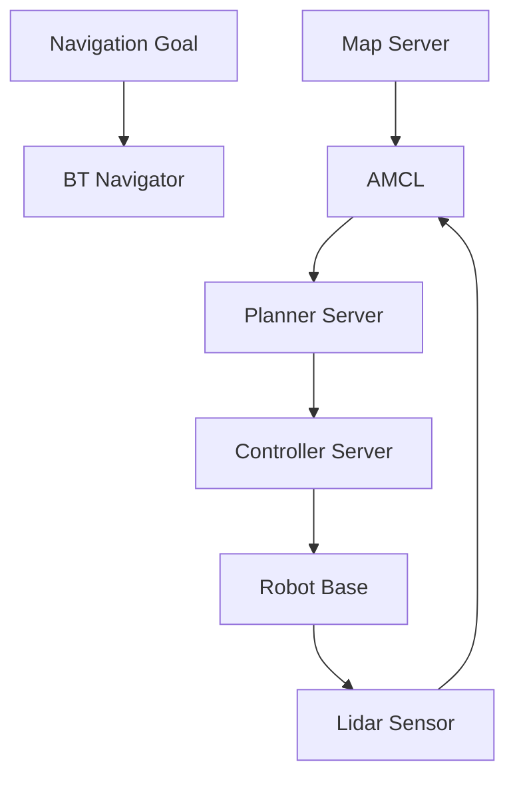

# ROS 2 Navigation Basics (Nav2)

One of the most common and complex tasks for a mobile robot is autonomous navigation. This involves perceiving the environment, localizing itself within a map, planning a path to a goal, and executing that path while avoiding obstacles. In ROS 2, the **Nav2** stack provides a powerful and flexible framework to achieve this.

## Overview of the Nav2 Stack

Nav2 is a collection of modular ROS 2 packages that work together to enable a robot to autonomously navigate. Its core components include:

1.  **Map Server**: Provides a map of the environment (often a 2D occupancy grid map).
2.  **AMCL (Adaptive Monte Carlo Localization)**: Estimates the robot's pose (position and orientation) within a known map using sensor data.
3.  **Planner Servers (e.g., NavFn, Smac Planner)**: Generate a global path from the robot's current pose to a goal pose.
4.  **Controller Servers (e.g., DWB Controller, TEB Controller)**: Generate velocity commands to follow the global path and avoid local obstacles.
5.  **Behavior Tree**: Orchestrates the high-level behaviors of the navigation system, such as recovery behaviors when the robot gets stuck.
6.  **BT Navigator**: A top-level node that uses behavior trees to manage the navigation flow.



## Basic Goal Navigation in Python

To send a navigation goal to a Nav2-enabled robot, you typically use a Nav2 client. This client sends a `NavigateToPose` action goal. Here's a Python example using the `rclpy.action` client to send a goal and monitor its status.

```python
import rclpy
from rclpy.node import Node
from rclpy.action import ActionClient

from nav2_msgs.action import NavigateToPose
from geometry_msgs.msg import PoseStamped
from tf2_ros.buffer import Buffer
from tf2_ros.transform_listener import TransformListener

class Nav2GoalSender(Node):

    def __init__(self):
        super().__init__('nav2_goal_sender')
        self._action_client = ActionClient(self, NavigateToPose, 'navigate_to_pose')
        self.tf_buffer = Buffer()
        self.tf_listener = TransformListener(self.tf_buffer, self)
        self.get_logger().info('Nav2 Goal Sender Node initialized.')

    def send_goal(self, x, y, yaw):
        self.get_logger().info('Waiting for action server...')
        self._action_client.wait_for_server()

        goal_msg = NavigateToPose.Goal()
        goal_msg.pose.header.frame_id = 'map' # Assuming navigation in map frame
        goal_msg.pose.header.stamp = self.get_clock().now().to_msg()
        
        goal_msg.pose.pose.position.x = x
        goal_msg.pose.pose.position.y = y
        goal_msg.pose.pose.orientation.z = yaw # Simplified for 2D yaw

        self.get_logger().info(f'Sending goal: x={x}, y={y}, yaw={yaw}')
        self._send_goal_future = self._action_client.send_goal_async(goal_msg)
        
        self._send_goal_future.add_done_callback(self.goal_response_callback)

    def goal_response_callback(self, future):
        goal_handle = future.result()
        if not goal_handle.accepted:
            self.get_logger().info('Goal rejected :(')
            return

        self.get_logger().info('Goal accepted :)')
        self._get_result_future = goal_handle.get_result_async()
        self._get_result_future.add_done_callback(self.get_result_callback)

    def get_result_callback(self, future):
        result = future.result().result
        status = future.result().status
        if status == ActionClient.GoalStatus.STATUS_SUCCEEDED:
            self.get_logger().info('Goal succeeded! Robot reached destination.')
        else:
            self.get_logger().info(f'Goal failed with status: {status}')
        rclpy.shutdown() # Shutdown node after goal completion/failure


def main(args=None):
    rclpy.init(args=args)
    node = Nav2GoalSender()
    
    # Example goal: go to (1.0, 0.5) with 0.0 yaw in map frame
    node.send_goal(1.0, 0.5, 0.0) 
    
    rclpy.spin(node)
    
    node.destroy_node()
    rclpy.shutdown()

if __name__ == '__main__':
    main()
```

This Python code sets up an `ActionClient` for `NavigateToPose`, sends a goal to a specific `(x, y, yaw)` in the `map` frame, and then monitors the action's progress and result.

## Chapter Summary

The Nav2 stack in ROS 2 provides a complete, modular, and robust solution for autonomous navigation in mobile robots. It integrates localization, global planning, local control, and behavior orchestration to allow robots to move intelligently through their environment.

## Assessment

1.  List and briefly describe three core components of the Nav2 stack.
2.  What is the purpose of AMCL in the Nav2 stack?
3.  Why is autonomous navigation a complex task for a robot?
4.  In the Python example, what does `goal_msg.pose.header.frame_id = 'map'` signify?
