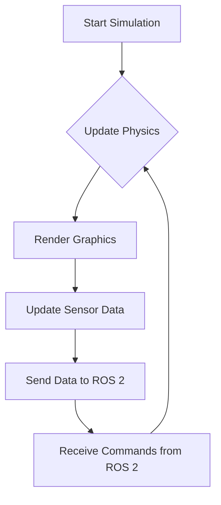

# The Digital Twin (Gazebo & Unity)

In robotics, developing and testing on physical hardware is slow, expensive, and often risky. What if you could build, test, and iterate on your robot's software in a perfectly simulated virtual world? This is the power of **simulation** and the concept of a **Digital Twin**.

## What is a Digital Twin?

A Digital Twin is a virtual model of a physical object or system. For our purposes, it's a high-fidelity simulation of our humanoid robot and its environment. This simulation isn't just a visual model; it includes a physics engine to simulate forces, gravity, and collisions, as well as models of the robot's sensors and actuators.

By developing against a digital twin, we can:
-   **Rapidly Prototype**: Test new algorithms without needing physical hardware.
-   **Run Parallel Tests**: Run thousands of tests simultaneously in the cloud.
-   **Train AI Models**: Generate vast amounts of synthetic data to train machine learning models (e.g., for object recognition).
-   **Test Safely**: Push the robot to its limits and test failure scenarios without risking damage to expensive hardware.

For this book, we will primarily focus on **Gazebo**, a powerful and widely used robotics simulator that integrates seamlessly with ROS 2. We will also discuss how **Unity** is used for creating more visually rich and interactive simulations.

## The Simulation Loop

At its core, a robotics simulator operates in a continuous loop, much like a video game engine.



1.  **Update Physics**: The physics engine (e.g., ODE, Bullet) calculates the effects of forces, gravity, and collisions on all objects in the world.
2.  **Render Graphics**: The rendering engine updates the visual representation of the world.
3.  **Update Sensor Data**: The simulator generates data for virtual sensors (cameras, IMUs, lidars) based on the state of the world.
4.  **Interface with ROS 2**: The simulator communicates with our ROS 2 nodes, sending sensor data and receiving actuator commands.

## Setting Up a Basic Gazebo World

Gazebo worlds are defined using SDF (Simulation Description Format) files, which are based on XML. Here is a very simple example of a world file that includes a ground plane and a light source.

```xml
<?xml version="1.0" ?>
<sdf version="1.7">
  <world name="default">
    <!-- A global light source -->
    <include>
      <uri>model://sun</uri>
    </include>
    <!-- A ground plane -->
    <include>
      <uri>model://ground_plane</uri>
    </include>
  </world>
</sdf>
```

To run this world, you would save it as `my_world.sdf` and run the command:
```bash
gazebo my_world.sdf
```
This will open the Gazebo simulator and load your simple environment, ready for you to spawn a robot model.

## Chapter Summary

This chapter introduced the critical role of simulation and the concept of a Digital Twin in modern robotics development. We learned that simulators like Gazebo provide a safe, fast, and cost-effective way to develop and test robot software. We also took a first look at how a simulation environment is structured and how it interfaces with ROS 2.

## Assessment

1.  What are three key advantages of using a digital twin for robotics development?
2.  Describe the main steps in a typical simulation loop.
3.  What is the purpose of an SDF file in Gazebo?
