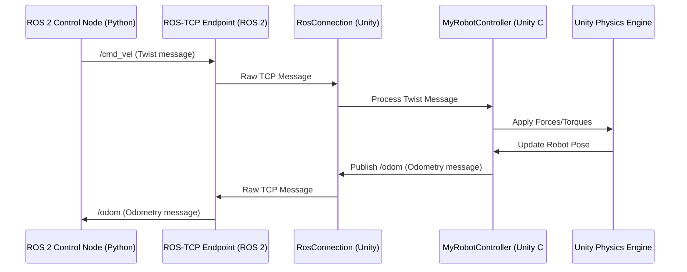

# Unity Simulation Integration

While Gazebo is the workhorse for many ROS-based robotics simulations, **Unity** offers a powerful alternative, especially when high-fidelity graphics, rich environments, and advanced rendering capabilities are desired. Unity, a popular game engine, has increasingly become a platform for robotics development, particularly with the advent of tools like the **Unity Robotics Hub**.

## Unity Robotics Hub

The Unity Robotics Hub is a collection of Unity packages, tutorials, and resources designed to streamline the integration of Unity with robotics ecosystems like ROS. Key components include:

-   **ROS-TCP Connector**: Enables direct communication between ROS 2 applications (e.g., Python or C++ nodes) and Unity projects using TCP/IP.
-   **URDF Importer**: Allows importing robot models described in URDF format directly into Unity, automatically generating joints, rigidbodies, and colliders.
-   **ROS-Unity Bridge**: Provides high-level interfaces and examples for sending sensor data from Unity to ROS and receiving commands from ROS to control Unity-simulated robots.
-   **Unity ML-Agents**: While not strictly robotics-specific, ML-Agents can be used within Unity simulations to train AI models for robot control using reinforcement learning, often in conjunction with ROS.

## Why Use Unity for Robotics Simulation?

-   **High-Fidelity Graphics**: Create visually stunning and realistic simulation environments.
-   **Advanced Physics**: Unity's physics engine offers robust collision detection and realistic dynamics.
-   **Rich Editor**: Leverage Unity's powerful editor for scene design, asset management, and rapid iteration.
-   **Extensibility**: Develop custom sensors, actuators, and environmental interactions using C# scripting.
-   **Synthetic Data Generation**: Generate vast amounts of varied synthetic data for training perception models, especially useful for deep learning.

## ROS-Unity Integration: Building a Basic Bridge

The core of ROS-Unity integration often relies on the ROS-TCP Connector package. Here's a conceptual overview of setting up a basic bridge to control a simulated robot in Unity from a ROS 2 node.

### 1. Unity Project Setup

-   **Install ROS-TCP Connector**: Add the package via Unity's Package Manager.
-   **Create a `RosConnection`**: Add a `RosConnection` component to a GameObject in your scene. This component manages the TCP connection to the ROS master.
-   **Create a Robot Controller Script**: Develop a C# script (e.g., `MyRobotController.cs`) that subscribes to ROS topics (e.g., `/cmd_vel` for velocity commands) and publishes ROS topics (e.g., `/odom` for odometry data). This script would use the `RosConnection` to send and receive messages.

### 2. ROS 2 Node Setup

-   **Install `ros_tcp_endpoint`**: This ROS 2 package provides the server-side endpoint for the TCP connection, bridging ROS 2's DDS (Data Distribution Service) with the Unity TCP messages.
-   **Create a Control Node**: Develop a Python or C++ ROS 2 node that publishes to the `/cmd_vel` topic (which your Unity controller subscribes to) and subscribes to `/odom` (published by Unity).

### Conceptual Flow

This setup allows for full bidirectional communication, enabling a ROS 2 system to command and receive feedback from a robot simulated within the Unity environment.

## Chapter Summary

Unity, powered by the Unity Robotics Hub, provides a compelling platform for robotics simulation, especially when high-fidelity visuals and advanced scene authoring are prioritized. Its integration with ROS 2 via tools like the ROS-TCP Connector allows for seamless control and data exchange between a ROS 2 control system and a Unity-based digital twin.

## Assessment

1.  What are some key advantages of using Unity over traditional robotics simulators like Gazebo?
2.  List three components provided by the Unity Robotics Hub.
3.  Explain the role of the `ROS-TCP Connector` and `ros_tcp_endpoint` in bridging Unity and ROS 2.
4.  Describe a scenario where Unity's high-fidelity graphics would be particularly beneficial for robotics development.
