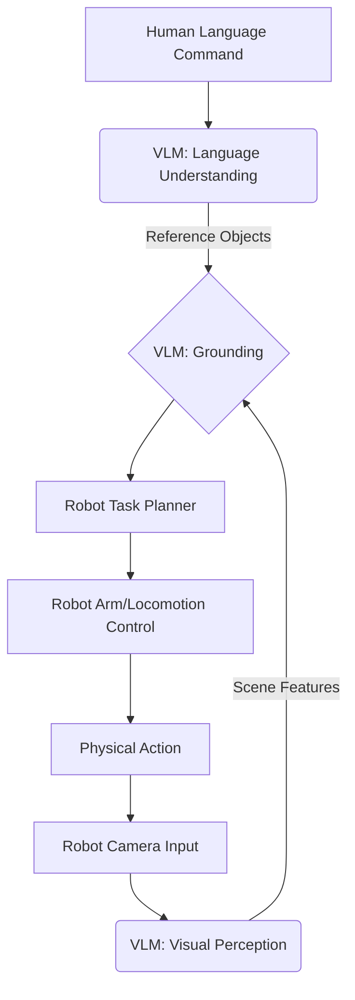

# Foundations of Vision-Language-Action (VLA)

The frontier of AI and robotics is moving towards systems that can understand and interact with the world in a more human-like way. This involves bridging the gap between perception (vision), high-level reasoning (language), and physical execution (action). This is the domain of **Vision-Language-Action (VLA)** models.

## What are Vision-Language Models (VLMs)?

At the core of VLA are **Vision-Language Models (VLMs)**. These are a class of AI models that are trained on massive datasets containing both images/videos and corresponding text descriptions. This allows them to develop a joint understanding of visual and linguistic information.

Key capabilities of VLMs:
-   **Image Captioning**: Generating descriptive text for an image.
-   **Visual Question Answering (VQA)**: Answering questions about the content of an image.
-   **Zero-shot Recognition**: Identifying objects or concepts they haven't been explicitly trained on, by leveraging their language understanding.
-   **Grounding**: Connecting linguistic phrases to specific regions in an image.

VLMs enable robots to interpret human instructions that reference objects or concepts in their visual field (e.g., "pick up the red mug next to the laptop").

## The VLA Pipeline in Robotics

A typical VLA pipeline for a robot involves:

1.  **Visual Perception**: The robot uses cameras (and other sensors) to perceive its environment. VLMs process these visual inputs.
2.  **Language Understanding**: Human commands are parsed and understood by the VLM.
3.  **Grounding**: The VLM "grounds" the linguistic references (e.g., "red mug") to actual objects or locations in the robot's visual scene.
4.  **Task Planning**: Based on the grounded understanding, the robot's AI generates a high-level plan of action.
5.  **Action Execution**: The robot translates the high-level plan into low-level motor commands and executes them.
6.  **Feedback**: The robot continuously monitors the environment and provides feedback to the VLM or a human operator.

## Challenges in VLA for Robotics

Despite rapid progress, VLA for robotics presents several challenges:

-   **Real-time Performance**: Many VLM operations can be computationally intensive, making real-time response on resource-constrained robots difficult.
-   **Ambiguity**: Human language is inherently ambiguous. Robots need to handle situations where commands are vague or unclear.
-   **Safety**: Ensuring that actions generated by VLMs are safe and do not lead to unintended consequences.
-   **Generalization**: VLMs trained in specific environments may struggle to generalize to novel or unstructured real-world settings.

## Chapter Summary

Vision-Language-Action (VLA) represents a powerful approach to creating more intelligent and intuitive robots. By combining advanced Vision-Language Models with robotic control, VLA allows robots to understand human commands, interpret visual scenes, and perform complex physical actions, paving the way for truly autonomous and collaborative robotic systems.

## Assessment

1.  What is a Vision-Language Model (VLM) and what problem does it aim to solve?
2.  List three key capabilities of VLMs.
3.  Describe the typical VLA pipeline for a robot, highlighting the interaction between its components.
4.  What are some of the main challenges in implementing VLA systems for real-world robots?
5.  How does "grounding" bridge the gap between language and perception in a VLA system?
