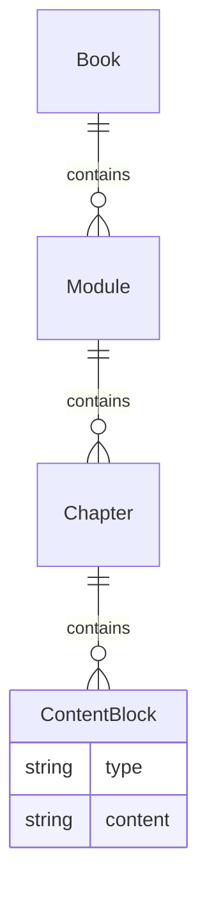

# Data Model: Book Content Structure

**Date**: 2025-12-06

This document outlines the conceptual data model for the content of the "Physical AI & Humanoid Robotics" book.

## Entity Relationship Diagram (ERD)

## Entities

### Book
Represents the entire "Physical AI & Humanoid Robotics" book. It is the root container for all content.

- **Attributes**:
  - `title`: The main title of the book.

### Module
A top-level thematic section of the book.

- **Attributes**:
  - `title`: The title of the module (e.g., "The Robotic Nervous System (ROS 2)").
  - `summary`: A brief overview of the module's content.
- **Relationships**:
  - Belongs to one `Book`.
  - Has many `Chapters`.

### Chapter
A specific chapter within a Module.

- **Attributes**:
  - `title`: The title of the chapter.
  - `learning_objectives`: A list of what the reader will learn.
- **Relationships**:
  - Belongs to one `Module`.
  - Has many `ContentBlocks`.

### ContentBlock
A generic block of content within a chapter. This allows for flexible content types.

- **Attributes**:
  - `type`: The type of content (e.g., `paragraph`, `code_snippet`, `diagram`, `example`).
  - `content`: The raw content (text, code, or Mermaid.js syntax).
